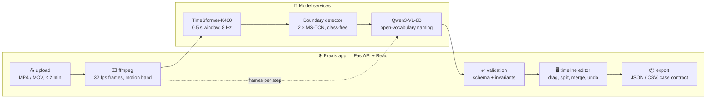

<div align="center">

<h1>
  <br>
  🅿🆁🅰🆇🅸🆂
  <br>
</h1>

<h3>Automatic action annotation for short manipulation videos</h3>

<p><i>Upload a clip, get it split into steps with an action, an object and a keyframe each,<br>correct the draft in a timeline editor, export JSON or CSV.</i></p>

<p>
  
  
  
  
  
</p>

<p>
  
  
  
  
  
</p>

<p>
  <a href="#tldr">TL;DR</a> •
  <a href="#quickstart">Quickstart</a> •
  <a href="#architecture">Architecture</a> •
  <a href="#boundary-detector">Boundary Detector</a> •
  <a href="#metrics">Metrics</a> •
  <a href="#features">Features</a> •
  <a href="#tech-stack">Tech Stack</a> •
  <a href="#quality">Quality</a> •
  <a href="#experiments">Experiments</a> •
  <a href="#documentation">Documentation</a>
</p>

</div>

---

<a id="tldr"></a>
## 🚀 TL;DR

Praxis is a **video annotation assistant** for the AI Product Hack 2026 case by IT Imperial: short clips of a person or a robot manipulating objects have to be turned into a list of steps — *picked up the bottle, rotated it, put it down* — that can later feed robotics datasets. The app produces the whole draft on its own; a reviewer **checks and corrects** instead of annotating from scratch.

The pipeline has one central design decision, earned the hard way: **the language model never touches time.** Step boundaries come from a class-free, learned **boundary detector** on video features (an ensemble of two MS-TCN heads over TimeSformer features at 8 Hz); the vision-language model only *names* segments that are already cut, with no class list, in open vocabulary. Every fallback the system takes — a service down, a clip too short — is reported in `warnings`, never hidden behind a green status.

> **Why a separate detector?** The case scores steps one-to-one at IoU ≥ 0.5 with a boundary error under 2 s. Asking a VLM for timecodes over-segments and costs 25–60 s per clip; the detector places boundaries in 0.4 s and infers the number of steps itself. The comparison, with numbers, is in [experiments/research/BOUNDARIES.md](experiments/research/BOUNDARIES.md).

---

<a id="quickstart"></a>
## ⚡ Quickstart

### 1. Docker

```bash
docker compose up --build       # then open http://localhost:8000
```

### 2. Native Python

Needs `ffmpeg` with libx264, Python 3.12 and Node 20+.

```bash
uv venv ~/.venvs/praxis --python 3.12
uv pip install --python ~/.venvs/praxis/bin/python -e ".[dev]"
cd web && npm install && npm run build && cd ..
~/.venvs/praxis/bin/python -m uvicorn praxis.api:app --port 8000
```

### 3. Model services (one GPU box, reached over HTTP)

| service | port | command |
| --- | --- | --- |
| video features, TimeSformer-K400 | 8102 | `python scripts/serve_video.py --port 8102 --model timesformer` |
| boundary detector, shipped ensemble | 8104 | `python scripts/serve_tas.py --port 8104 --checkpoint checkpoints/boundary.pt` |
| naming, Qwen3-VL-8B | 8100 | `python scripts/serve_vlm.py --port 8100 --model Qwen/Qwen3-VL-8B-Instruct` |

Point the app at them with `PRAXIS_VIDEO_BASE_URL`, `PRAXIS_TAS_BASE_URL`, `PRAXIS_VLM_BASE_URL` (see `.env.example` for the SSH-tunnel variant and [docs/PIPELINE.md](docs/PIPELINE.md) for every setting). `/health` of the detector must report `"dim": 768, "members": 2`. Without the services the app still runs — boundaries fall back to kernel change-point, features to grey blocks, steps arrive unlabelled — and says so in `warnings`.

### 4. One clip end to end

```bash
curl -F "file=@examples/clip.mp4" http://localhost:8000/api/videos   # 202 + job id
curl http://localhost:8000/api/videos/<id>                           # status, stage, progress, warnings
curl http://localhost:8000/api/videos/<id>/export.json > annotation.json
```

---

<a id="architecture"></a>
## 🧭 Architecture



| stage | what runs | why this one |
| --- | --- | --- |
| frames | ffmpeg, 32 fps, 256 px | one pass gives both the encoder input and the motion band for the timeline |
| features | TimeSformer-K400, 16-frame window (0.5 s), stride 4 (8 Hz), cached on disk | Kinetics-supervised features beat self-supervised ones on temporal tasks; the short window is what makes sub-second steps visible |
| boundaries | ensemble of two MS-TCN heads, one logit per frame, peaks above 0.7 at least 0.5 s apart | class-agnostic by construction — trained on timecodes only — so it transfers to any domain |
| labels | Qwen3-VL-8B, 5 frames + before/after context, open vocabulary | no class list exists in advance, so the answer is generated, not picked |
| validation | pydantic schema and invariants | no overlaps, keyframe inside its step, everything inside the duration |
| export | the case owner's contract, integer milliseconds | `schema_version`, `model_version`, latency, cost, artifacts |

Granularity stays a knob, not a rewrite: `PRAXIS_MIN_SEGMENT_SEC` (peak interval and minimum step), `PRAXIS_TAS_THRESHOLD` (peak height) and `PRAXIS_IDLE_RATIO` (pauses) are all runtime settings.

---

<a id="boundary-detector"></a>
## 🎯 Boundary Detector

The detector is the part of the pipeline the case metric depends on most, and the part that was chosen by measurement rather than preference. The full evidence is in [experiments/](experiments/); this section is the summary.

### What ships

| | |
| --- | --- |
| **Model** | MS-TCN (Farha & Gall, 2019): 2 stages × 10 dilated residual layers, 64 filters, per-stage loss, smoothing loss. One logit per frame — *did the action change here* — instead of a class softmax, so no taxonomy is ever learned. |
| **Input** | TimeSformer-K400 features, 768-d, 16-frame window at 32 fps (0.5 s), stride 4 (8 Hz). No motion or difference channels: measured, no gain. |
| **Ensemble** | two checkpoints averaged frame by frame and packed into one file, [checkpoints/boundary.pt](checkpoints/README.md): one trained on 554 Assembly101 fine-grained clips, one on the same clips plus 60 LIBERO robot episodes. |
| **Decoder** | local maxima of the averaged probability above 0.7, at least 0.5 s apart; segments between cuts become steps. |
| **Training signal** | step start and end timecodes only, from public datasets (Assembly101, LIBERO). No manual annotation, no class labels. |

### How it was chosen

1. **Class-free head over a frozen video encoder** — the case has no class list, and a boundary is the same event in any domain ([research](experiments/research/BOUNDARIES.md)).
2. **Architecture ablation is flat on the target regime.** 2 vs 4 stages, boundary width σ, motion channels, C2F augmentation, test-time augmentation, three seeds and three times more data all land within ±0.01 on 85 atomic clips whose recording sessions never appear in training ([ranking](experiments/results/2026-09-05-ranking85.md), [stages](experiments/results/2026-09-05-stages-variants.md)).
3. **What is *not* flat: the feature time resolution.** Halving the encoder window to 0.5 s at 8 Hz sharpens the peaks enough for a 0.5 s interval between cuts, which is where the short steps live: +0.05 for the same model and corpus ([final report](experiments/results/2026-09-05-boundary-final.md)).
4. **The ensemble buys robustness, not points.** On its own regime it adds +0.01–0.03; outside it — EPIC-Kitchens, robot renders — a single fine-grained model over-segments a robot into twenty pieces, while members that saw 60 robot episodes keep both regimes ([cross-embodiment](experiments/results/2026-09-05-cross-embodiment.md)).
5. **Decoding was swept offline** over dumped probabilities — threshold, interval, prominence, penalised DP — so every number above uses the decoder the application actually runs ([decoders](experiments/results/2026-09-05-decoders-base.md)).

### Reproduce a number

```bash
# probabilities of the served checkpoint on a labelled set, once
python scripts/dump_scores.py --clips data/pool_atomic/clips --gt data/pool_atomic/gt --out work/scores/final_85.npz
python scripts/decode_sweep.py work/scores/final_85.npz            # best decoder offline
python scripts/boundary_report.py work/scores/final_85.npz         # product metrics under the app decoder
python scripts/ensemble_scores.py a_85.npz b_85.npz --out ab_85.npz  # any ensemble without re-running clips
```

---

<a id="metrics"></a>
## 📊 Metrics

Three labelled validation sets, all from public datasets with their own ground truth. Recording sessions of the atomic set never appear in any training corpus.

| set | source | clips | steps per clip | median step | regime |
| --- | --- | --- | --- | --- | --- |
| **atomic** | Assembly101 fine-grained | 85 | 9.0 | 0.87 s | the case: pick up, rotate, move, put down |
| **mid** | EPIC-Kitchens-100 | 16 | 4.2 | 1.4 s | egocentric kitchen actions |
| **robot** | LIBERO hold-out | 10 | 2.0 | 6 s | simulated manipulator, subtask boundaries |

Boundary detector, application decoder, no labels involved:

| metric | atomic | mid | robot | what it means |
| --- | --- | --- | --- | --- |
| step-F1 @ IoU 0.5 — the case rule | **0.498** | **0.535** | **0.733** | one-to-one matching of steps at IoU ≥ 0.5; the single model shipped before scored 0.422 / 0.413 / 0.096 |
| step-F1 @ IoU 0.25 | 0.714 | 0.718 | 0.733 | the same with looser overlap |
| boundary precision, ±2 s | **0.90** | 0.74 | — | share of our cuts within 2 s of a true boundary — the case's boundary tolerance |
| boundary precision, ±1 s | 0.83 | 0.67 | — | the same at half the tolerance |
| boundary recall, ±2 s | 0.52 | 0.51 | — | share of true boundaries we cut within 2 s; the rest are mostly sub-second steps |
| boundary error, matched cuts | 0.28 s | 0.36 s | — | mean distance of matched cuts to the truth |
| steps per clip, ours − truth | −0.2 | +1.3 | −0.8 | over- or under-segmentation |

The robot hold-out has two six-second subtasks per episode, so its step-F1 says mainly that the detector does not over-segment a manipulator (the single fine-grained model cut it into eleven pieces); its boundary columns are omitted because one true boundary per clip makes them meaningless. Numbers come from `scripts/boundary_report.py --thr 0.7 --gap 0.5` on the dumped probabilities of `checkpoints/boundary.pt`; every table behind them is in [experiments/results/2026-09-05-boundary-final.md](experiments/results/2026-09-05-boundary-final.md).

Product constraints from the case, measured end to end on the app:

| | value | case target |
| --- | --- | --- |
| processing per 20 s clip, with naming | ~40 s | ≤ 120 s |
| boundary error, matched cuts | 0.28 s | ≤ 2 s |
| valid JSON / CSV export | 100% | 100% |
| clips returned without a step | 0 (whole clip is one step when nothing is found) | — |

Naming (open vocabulary, ground-truth boundaries, scored against every admissible label): action 0.558, object 0.660, pair 0.426 — the history and the rejected variants are in [experiments/HISTORY.md](experiments/HISTORY.md).

---

<a id="features"></a>
## ✨ Features

- **Timeline editor** — drag boundaries with magnetic snapping to detected events, split and merge steps, undo/redo, keyframe filmstrip, hot keys, autosave; every edit and the time spent are logged, which is the evidence behind the "×3 faster than manual" claim rather than a declaration.
- **Open-vocabulary naming** with confidence — the VLM answers in the language of `PRAXIS_LANGUAGE` and reports its own confidence, or none; low-confidence steps are highlighted for review.
- **Honest degradation** — every fallback (kernel change-point instead of the detector, grey features, unnamed steps) lands in `warnings` on the job; nothing pretends to be fine.
- **Two API surfaces** — the app's own `/api/videos` and the case owner's `/api/v1` contract with export in integer milliseconds, `schema_version`, latency and cost ([docs/CONTRACT_V1.md](docs/CONTRACT_V1.md)).
- **One-knob granularity** — atomic actions by default, coarse steps with pauses by three environment variables.

---

<a id="tech-stack"></a>
## 🛠️ Tech Stack

| Layer | Tooling |
| --- | --- |
| **Boundaries** | MS-TCN ensemble (PyTorch) over TimeSformer-K400 features · peak decoder · kernel change-point fallback |
| **Naming** | Qwen3-VL-8B-Instruct via vLLM · context frames · self-reported confidence |
| **Backend** | FastAPI · pydantic v2 contract · SQLite · background jobs · ffmpeg |
| **Frontend** | React 19 + TypeScript + Vite · canvas timeline |
| **Evaluation** | dumped-probability harness (`dump_scores`, `decode_sweep`, `score_table`, `ensemble_scores`, `boundary_report`) · bootstrap intervals · case-rule scorer |
| **Data** | builders for Assembly101 windows, LIBERO episodes, Charades/EPIC subsets — public ground truth only |
| **Quality** | 129 pytest tests · Ruff |
| **DevOps** | Dockerfile · docker-compose · GPU services behind HTTP with health checks |

---

<a id="quality"></a>
## 🔬 Quality

**129 tests**, all green:

```bash
pytest -q
```

| suite | what it locks down |
| --- | --- |
| `test_schema.py`, `test_contract_v1.py` | the annotation contract: round trips, invariants, export formats |
| `test_api.py`, `test_api_v1.py` | upload → job → annotation → export over both API surfaces |
| `test_segment.py`, `test_motion_band.py` | the learned segmenter: feature stacking, fallback, dimension checks, prominence |
| `test_pack_ensemble.py`, `test_ensemble_scores.py` | packed ensembles load and average exactly as the service does |
| `test_train_guard.py`, `test_eval_variants.py`, `test_eval.py` | training refuses an incomplete corpus; evaluation parsing; metric arithmetic |
| `test_mix.py`, `test_robot_boundaries.py`, `test_export_libero.py`, `test_atomic_windows.py` | dataset builders and their provenance |
| `test_naming.py` | naming request flags and open-vocabulary answers |

The trainer aborts when more than 2% of a corpus has no features — a feature service that dies mid-run used to shrink a corpus silently and produce a model that looked ordinary and was not.

---

<a id="experiments"></a>
## 🧪 Experiments

Everything measured on the way to the shipped detector lives in [experiments/](experiments/README.md): validation pools and their reports, the architecture and feature ablations with every table, the reading list and the papers, the design and the implementation plan, and the scripts that ran the experiment queue on the GPU box.

| question | answer | where |
| --- | --- | --- |
| VLM or a separate detector for boundaries? | detector: better at IoU 0.5, 60× faster | [BOUNDARIES.md](experiments/research/BOUNDARIES.md) |
| Which encoder? | frozen encoders are within the interval of each other; TimeSformer is fastest | [HISTORY.md](experiments/HISTORY.md) |
| Which architecture? | MS-TCN, 2 stages, plain features — everything else is within ±0.01 | [ranking85](experiments/results/2026-09-05-ranking85.md), [stages](experiments/results/2026-09-05-stages-variants.md) |
| Human vs robot data? | step-length regime dominates embodiment; mix the regimes in the members | [cross-embodiment](experiments/results/2026-09-05-cross-embodiment.md) |
| Where is the headroom? | feature time resolution and boundary localisation, not data volume or decoding | [boundary-final](experiments/results/2026-09-05-boundary-final.md) |

---

## 📂 Project Structure

```
praxis/
├── praxis/               # annotation contract, API, storage, jobs, media
│   └── pipeline/         # segmenters: learned (default), kernel change-point, baselines
├── scripts/              # model services, dataset builders, training, evaluation harness
├── checkpoints/          # boundary.pt — packed ensemble; members/ — its four checkpoints
├── web/                  # React timeline editor
├── docs/                 # product docs: pipeline guide, decision, case, contract, MVP, QA
├── experiments/          # research: results, reports, reading, plans, GPU-box queue scripts
├── tests/                # 129 pytest tests
├── Dockerfile
└── docker-compose.yml
```

---

<a id="documentation"></a>
## 📚 Documentation

- **Run it** — [docs/PIPELINE.md](docs/PIPELINE.md) — services, settings, restart procedure.
- **Decision** — [docs/DECISION.md](docs/DECISION.md) — the algorithm and why, with the numbers.
- **Case** — [docs/CASE.md](docs/CASE.md) — requirements, contract and the metric rule · [docs/CONTRACT_V1.md](docs/CONTRACT_V1.md) — the `/api/v1` layer · [docs/MVP.md](docs/MVP.md) — readiness checklist · [docs/QA.md](docs/QA.md).
- **Weights** — [checkpoints/README.md](checkpoints/README.md) — what is in the ensemble and how to rebuild it.
- **Research** — [experiments/README.md](experiments/README.md) — index of everything measured.

---

<div align="center">
  <sub>Built for the AI Product Hack 2026 case by IT Imperial · 2026</sub>
</div>
